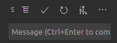

# Coding Dojo : DevWorkflowForTheOps

## Description
This repository contains instructions and assets to perform the coding dojo "Development workflow for the ops" which is designed to give some basics about the workflow and the tools involved when properly developping Ops' assets such as scripts and infrastructure templates.

This coding dojo will involved the use of VSCode, Git, Azure DevOps, PowerShell and can either be perfomed on a Windows or a Linux Box.


## Requirements :
- [Windows] Windows PowerShell 5.x or later and/or PowerShell 6.x or later
- [Linux] PowerShell 6.x or later
- Git
- VSCode
- Access to an Azure DevOps project with enough privilege to create a repo and create a pipeline

**HELP** : To install git for Windows and VSCode using Chocolatey :
- *Install Chocolatey* : Set-ExecutionPolicy Bypass -Scope Process -Force; iex ((New-Object System.Net.WebClient).DownloadString('https://chocolatey.org/install.ps1'))
- *Install Git* : choco install git.install --params "/GitOnlyOnPath /NoAutoCrlf /NoShellIntegration"
- *Install VSCode* : choco install vscode --params "/NoDesktopIcon"

**NOTES** : 
- ***[CMD]*** indicates tasks to be to done in PowerShell and ***[GUI]*** indicates tasks to be performed using graphical interfaces.
- When square brackets appear in the instructions below
  - Replace ***[user_name]*** and ***[user_email]*** by your name and email
  - Replace ***[devOpsOrg]***, ***[devOpsProject]*** and ***[devOpsRepo]*** by the DevOps organization, project and repo on which you've been granted access.
  - Replace the ***[XX]*** by the 2 digit index assigned to you by the instructor.

# Scenario 1 : Initialize a new repo

### 0. [CMD] Initiate Git config
```
git config --global user.name "[user_name]"
git config --global user.email "[user_email]"
```

### 1. [CMD] Create a new directory, a new script and initiate a local repo

```
New-Item -Name "project" -ItemType "directory"
Set-Location -Path project
New-Item -Name "new-script.ps1" -ItemType "file"
git init
```

**NOTE** : The *"git init"* can be performed in VSCode in the *source control* menu :

|   |
|---|
| Click the '+' button |
|  |

### 2. [CMD] Stage all changes and commit

```
git add -A
git commit -m "initial commit"
```
**NOTE** : The *"git add"* can be performed in VSCode in the *"changes"* section of the *source control* menu:

|   |
|---|
| Click the '+' button |
|  |

### 3. [CMD] Modify your script, stage the change and commit

```
Add-Content new-script.ps1 "Write-Output 'hello world'"
git add new-script.ps1
git commit -m "Adding content to script"
```

**NOTE** : The *"git commit"* can be performed in VSCode at the top of the *source control* menu:

|   |
|---|
| Comment the *"message"* box and click the *"check"* button |
|  |

### 4. [GUI] Prepare Azure DevOps to upload your work to a new hosted Git repo (origin)

- Create a new **EMPTY** (untick "Add a README") repo named *init[XX]* in the dojo project https://dev.azure.com/[devOpsOrg]/_git/CodingDojo

|   |
|---|
| In the git repo list, select *"New repository"* |
|  |
| In the new menu, name your repo and unselect *"Add a README"* |
|  |

**NOTE** : If get an error because you created the repository with a README, you can fix this by pulling first this change from origin with the command :
```
git pull origin master --allow-unrelated-histories
```

- Create a new **PAT** (Personal Access Token) with permissions : *Code* (Read & write) + *Packaging* (Read)

|   |
|---|
| Select *"Personal Access Token"* in the top right hand profile menu |
|  |
| Give the PAT a name and select the following permissions only |
|  |

### 5. [CMD] Configure Git to retain your credentials, add the newly created origin and push the content

```
git config --global credential.helper store
git remote add origin https://[devOpsOrg]@dev.azure.com/[devOpsOrg]/[devOpsProject]/_git/init[XX]
git push -u origin --all
```

**NOTE** : If you get an error because the origin was not correctly configured, you can fix this by reconfiguring the origin with the command :
```
git remote set-url origin [url]
```

**NOTE** : The *"git push"* can be performed in VSCode at the bottom of the VSCode window, which will both push and pull changes to and from origin :

|   |
|---|
| Click the *"sync"* button (cycle arrows) |
|  |

# Scenario 2 : Clone existing repo and build a pipeline in Azure DevOps

**NOTE** : Don't forget to change your current working directory before running commands !

### 0. [GUI] Open the DevWorkflowForTheOps repo and inspect the content

https://github.com/antomate/DevWorkflowForTheOps

### 1. [CMD] Clone GitHub repo and change current dir to the cloned repo

```
git clone https://github.com/antomate/DevWorkflowForTheOps.git
Set-Location -Path DevWorkflowForTheOps
```

### 2. [GUI] Prepare Azure DevOps to upload your work to a new hosted Git repo (origin)

- Create a new **EMPTY** (untick "Add a README") repo named *"DevWorkflowForTheOps[XX]"* in the dojo project https://dev.azure.com/[devOpsOrg]/_git/CodingDojo

**NOTE** : If get an error because you created the repository with a README, you can fix this by pulling first this change from origin with the command :
```
git pull origin master --allow-unrelated-histories
```

### 3. [CMD] Change the origin to the new repo

```
git remote set-url origin https://[devOpsOrg]@dev.azure.com/[devOpsOrg]/[devOpsProject]/_git/DevWorkflowForTheOps[XX]
git push -u origin --all
```

### 4. [GUI] Create and run the build in Azure DevOps

- Setup the build pipeline using *"Select an existing YAML file"* definition included in the repo (/pipeline/config-CI.yml)

|   |
|---|
| In the *"File"* section of your repo, click *"Set up build"* button |
|  |
| Select third option *"Existing Azure pipelines YAML file"* |
|  |
| Select path *"/pipeline/config-CI.yml"* |
|  |

- Run the build & inspect the result

|   |
|---|
| Click *"Run"* to instanciate the build |
|  |

**NOTE** : Their should be an issue on a JSON file syntax

|   |
|---|
|  |

### 5. [CMD] Create a new branch to fix the issue

```
git pull
git checkout -b "fixJson"
git push -u origin "fixJson"
```

**NOTE** : The *"git checkout"* can be performed in VSCode using *"branch"* button (by default set on master) at the bottom of the VSCode window :

|   |
|---|
| Click on the *"branch"* button to open branch selection |
|  |

### 6. [CMD] Fix the issue and upload the 

- Fix the JSON syntax in VSCode

```
git add ./scripts/dictionary.json
git commit -m "Fixing JSON syntax in dictionary.json"
git push -u origin --all
```

### 7. [GUI] Validate the change and merge in Azure DevOps

- Restart a build from the new branch

- Create and complete a pull request from "fixJson" into "master"

|   |
|---|
| In the *"File"* section of your repo, click *"Create a pull request"* button |
|  |
| In the new menu, verify the branches, the name and description and click *"Create"* |
|  |
| In the new menu, click on *"complete"* |
|  |
| Inspect the various types of merge and the options and complete the *merge with no fast-forward* and *"delete branch"* option |
|  |

### 8. [CMD] Update your local master after the merge

```
git checkout master
git pull
```

### 9. [GUI] Create and run a release in Azure DevOps

- From your previous succesful *build* create a new release using no template

|   |
|---|
| Click a the *"release"* button |
|  |
| Select the *"Empty Job"* buttion |
|  |

- Edit the tasks of *stage 1* to add a *PowerShell* task

|   |
|---|
| Click on the link (1 job, 0 task) bellow *"Stage 1"* |
|  |
| Add a task in the job running on agent and search the PowerShell task |
|  |
| Complete the task parameters according to your index |
|  |

**NOTE** : Lines to complete :
```
$(System.DefauItWorkingDirectory)/DevWorkflowForTheOps[XX]/LucBessonScriptGenerator/scripts/new-scenario.ps1
-dictionaryPath "$(System.DefauItWorkingDirectory)/DevWorkflowForTheOps[XX]/LucBessonScriptGenerator/scripts/dictionary.json"
```
